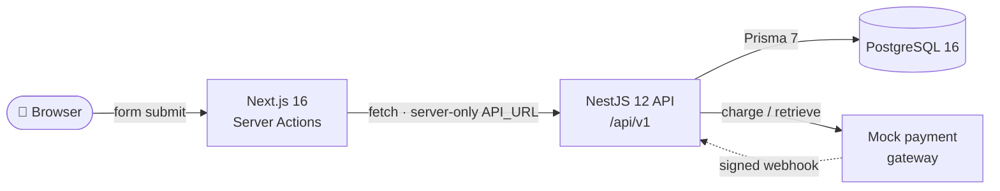
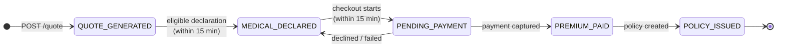
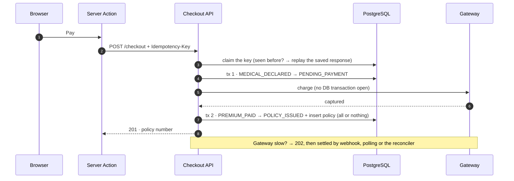

<div align="center">

# 🛡️ CareShield Max — D2C Health Insurance

**Get a price, declare your health, pay, and receive a policy — in one short, safe journey.**


</div>

---

## ⚡ Quick start

> Needs **Node 22 or 24** and **Docker** (for the local PostgreSQL).

```bash
npm install                                        # installs both apps + generates the Prisma client
cp apps/api/.env.example apps/api/.env
cp apps/web/.env.example apps/web/.env.local

npm run db:up                                      # PostgreSQL 16 on localhost:5432
npm run db:migrate                                 # apply all migrations

npm run api:dev                                    # API  → http://localhost:4000/api/v1/health/ready
npm run web:dev                                    # Web  → http://localhost:3000
```

Try it from the terminal:

```bash
curl -X POST http://localhost:4000/api/v1/insurance/quote \
  -H 'Content-Type: application/json' \
  -d '{"age": 50, "hasPreExistingConditions": true}'
# → 201 · total "20000.00" · locked for 15 minutes
```

---

## 🧭 The journey

| Step | What the customer does | What the system guarantees |
|:---:|---|---|
| **1 · Quote** | Enters age + pre-existing conditions | A deterministic price, saved and **locked for 15 minutes** |
| **2 · Health** | Answers 6 health questions | Eligibility is checked; ineligible applicants are told why |
| **3 · Pay** | Picks a (mock) card or UPI and pays | **Charged at most once**, and a policy number is issued |

### 💰 Pricing

| Age | Pre-existing conditions | Premium |
|---|:---:|---:|
| 18 – 45 | No | **₹10,000** |
| 18 – 45 | Yes | **₹15,000** |
| 46 – 99 | No | **₹15,000** |
| 46 – 99 | Yes | **₹20,000** |

Base ₹10,000 · **+50 %** if age > 45 · **+₹5,000** flat for pre-existing conditions.

---

## 🏗️ How it works



- The **browser never talks to the API directly**. Server Actions call it from the Next.js server, so the API address stays private and there is no CORS surface.
- **The API owns every rule.** Pricing, eligibility and payments are decided on the server; the website only displays results.
- **PostgreSQL is the last line of defence.** Constraints and triggers reject invalid data even if application code had a bug.

---

## 🔄 Quote lifecycle



The four states from the brief are all there, in order. `PENDING_PAYMENT` is one extra step that lets the payment call happen **outside** a database transaction (see below).

Every transition is enforced **three times**: in the TypeScript state machine, by a compare-and-set `UPDATE … WHERE status = <from>`, and by a PostgreSQL trigger. Every change is also written to an **append-only audit trail** (`quote_status_transitions`) by the database itself.

---

## 💳 Checkout: atomic and idempotent



- **No double charges.** The same `Idempotency-Key` always returns the first result. Reusing a key with a different body is rejected (`422`).
- **No half-finished policies.** Marking the quote paid and creating the policy happen in **one transaction**; if anything fails, it all rolls back.
- **No locks held during the network call.** The quote is moved to `PENDING_PAYMENT` first, so a slow gateway never keeps a database transaction open.
- **Double clicks are blocked in the UI too**, using `useActionState` plus a submit guard.

### 🧪 Mock payment tokens

| Token | Result |
|---|---|
| `tok_visa_4242` · `tok_mastercard_4444` · `tok_upi_success` | ✅ Approved |
| `tok_card_declined` | ❌ Declined (`402`, not charged) |

---

## 📋 Brief → code

| Task | Where |
|---|---|
| **1.1** `quotes` ↔ `policies` + state machine | [`schema.prisma`](apps/api/prisma/schema.prisma) · [`quote-state-machine.ts`](apps/api/src/insurance/domain/quote-state-machine.ts) |
| **1.2** `NUMERIC(10,2)`, `created_at`, `expires_at` | [`migrations/…_init`](apps/api/prisma/migrations/20260921000000_init/migration.sql) |
| **2.1** Strict `POST /api/v1/insurance/quote` | [`insurance.controller.ts`](apps/api/src/insurance/insurance.controller.ts) · [`create-quote.dto.ts`](apps/api/src/insurance/dto/create-quote.dto.ts) · [`validation.ts`](apps/api/src/common/validation.ts) |
| **2.2** Premium rules | [`premium-calculator.ts`](apps/api/src/insurance/domain/premium-calculator.ts) |
| **2.3** Save with `expires_at` = now + 15 min | [`quote-lock.ts`](apps/api/src/insurance/domain/quote-lock.ts) · [`quotes.service.ts`](apps/api/src/insurance/quotes.service.ts) |
| **3.1** Accessible Next.js + Tailwind UI | [`components/flow/`](apps/web/src/components/flow) · [`actions.ts`](apps/web/src/app/actions.ts) |
| **3.2** Countdown + expiry gate | [`lock-clock.ts`](apps/web/src/lib/lock-clock.ts) · [`useCountdown.ts`](apps/web/src/hooks/useCountdown.ts) · [`ExpiredPanel.tsx`](apps/web/src/components/flow/ExpiredPanel.tsx) |
| **3.3** `useActionState` loading + no double clicks | [`PaymentStep.tsx`](apps/web/src/components/flow/PaymentStep.tsx) · [`useSubmit.ts`](apps/web/src/hooks/useSubmit.ts) |
| **4.1** Atomic transaction with rollback | [`payment-settlement.service.ts`](apps/api/src/insurance/checkout/payment-settlement.service.ts) |
| **4.2** Idempotency key | [`idempotency.service.ts`](apps/api/src/insurance/checkout/idempotency.service.ts) · [`checkout.controller.ts`](apps/api/src/insurance/checkout/checkout.controller.ts) |
| Mock payment API client | [`payment-gateway.ts`](apps/api/src/insurance/checkout/payment-gateway.ts) · [`mock-payment-gateway.ts`](apps/api/src/insurance/checkout/mock-payment-gateway.ts) |
| Ephemeral PostgreSQL | [`docker-compose.yml`](docker-compose.yml) |

---

## 🧠 Design decisions

| Decision | Why |
|---|---|
| **Money is `NUMERIC(10,2)` → `Decimal` → `"15000.00"` strings** | No floating-point rounding anywhere, from database to JSON. |
| **The countdown uses the server's `remainingMs`** (`expires_at` is still returned) | A wrong or changed device clock can't make the timer run long. The server always has the final say (`410` once expired). |
| **Header is `Idempotency-Key`** | The standard spelling of the brief's `idempotency_key`; some proxies drop headers that contain underscores. |
| **Extra `PENDING_PAYMENT` state** | Keeps the gateway call out of any database transaction; webhooks and the reconciler resolve slow payments. |
| **Audit trail written by a DB trigger** | Every status change is recorded, even from raw SQL, and the table is append-only. |
| **Strict validation** | Unknown fields are rejected and nothing is silently converted (`"30"` is not an age). |

---

<details>
<summary><b>📡 API reference</b></summary>

| Method | Path | Result |
|---|---|---|
| `POST` | `/api/v1/insurance/quote` | `201` quote · `400` invalid input |
| `POST` | `/api/v1/insurance/quote/:id/medical-declaration` | `200` declared · `422` not eligible · `410` expired |
| `POST` | `/api/v1/insurance/checkout` *(header `Idempotency-Key`)* | `201` policy · `202` processing · `402` declined · `409` in progress · `410` expired |
| `GET` | `/api/v1/insurance/quote/:id/payment` | Payment status: `ISSUED` · `PROCESSING` · `NOT_PAID` |
| `POST` | `/api/v1/payments/webhook` | Signed gateway callback |
| `GET` | `/api/v1/payments/reconcile` | Settles stuck payments *(Bearer `CRON_SECRET`)* |
| `GET` | `/api/v1/health/live` · `/api/v1/health/ready` | Liveness · readiness (checks the DB) |

All errors share one shape: `{ statusCode, error, message, details? }`. A database outage returns a clear `503` instead of a crash.

</details>

<details>
<summary><b>🗂️ Project structure</b></summary>

```
.
├── apps/
│   ├── api/                      NestJS API
│   │   ├── prisma/               schema + SQL migrations (tables, triggers, constraints)
│   │   └── src/
│   │       ├── insurance/
│   │       │   ├── domain/       pure business rules: pricing, lock, eligibility, state machine
│   │       │   ├── dto/          request validation + response shape
│   │       │   ├── checkout/     payments, idempotency, settlement, policy issuing
│   │       │   └── quotes.*      controller → service → repository
│   │       ├── common/           validation pipe, error filters, request metadata
│   │       └── health/           liveness + readiness
│   └── web/                      Next.js website
│       └── src/
│           ├── app/              page, layout, Server Actions
│           ├── components/       landing page + purchase flow
│           ├── hooks/            countdown, submit guard, error focus
│           └── lib/              server-only API client, clock-safe countdown
├── docker-compose.yml            local PostgreSQL
└── package.json                  npm workspaces + root scripts
```

</details>

<details>
<summary><b>🛠️ Scripts</b></summary>

| Command | Does |
|---|---|
| `npm run db:up` / `db:down` | Start / stop the local PostgreSQL |
| `npm run db:migrate` | Apply database migrations |
| `npm run api:dev` | API with hot reload on `:4000` |
| `npm run web:dev` | Website on `:3000` |
| `npm run lint` | Lint both apps |
| `npm run build` | Production build of both apps |
| `npm test` | Unit, database and end-to-end tests (use the local Docker DB — tests reset tables) |

</details>

<details>
<summary><b>📌 Assumptions</b></summary>

- Cover is available from age **18 to 99**.
- Eligibility rules are placeholders: a **terminal illness** can't be covered online, and a condition the quote wasn't priced for requires a **recalculation**.
- Payments use a **mock gateway** (test tokens, no real money) that is idempotent like real providers.
- A policy covers **12 months** from the moment it is issued.

</details>

---

<div align="center">

Built on feature branches · merged through pull requests · [semantic commits](https://www.conventionalcommits.org/)

</div>
