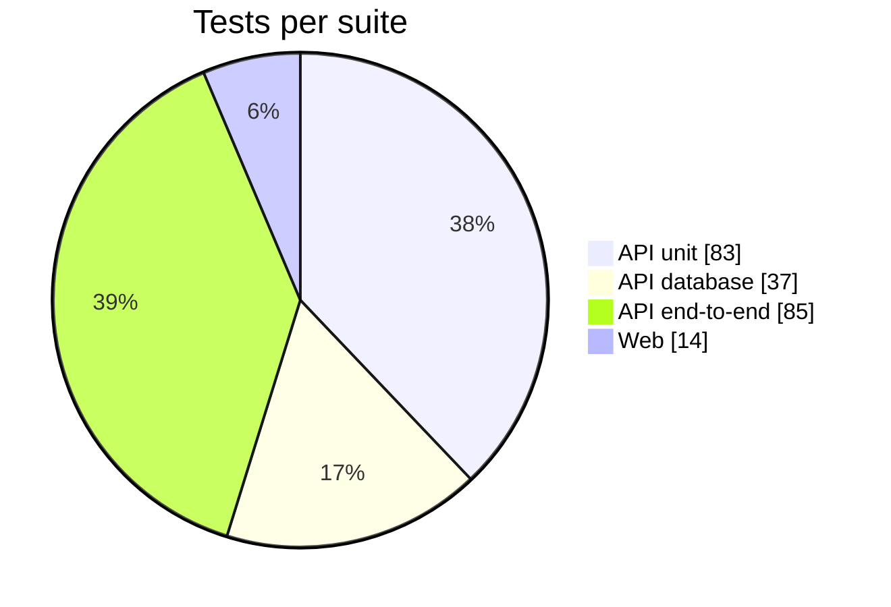

<div align="center">

# 🧪 CareShield Max — Test Report

**219 tests · 22 test files · 4 suites · 0 failures**


</div>

---

## ✅ Summary

| Suite | What it proves | Files | Tests | Result | Time |
|---|---|---:|---:|:---:|---:|
| **API unit** | Pure business rules: pricing, 15-minute lock, eligibility, state machine, validation, webhook signatures | 10 | 83 | ✅ 83 / 83 | 6.2 s |
| **API database** | Rules enforced by PostgreSQL itself: `NUMERIC(10,2)`, triggers, constraints, audit trail | 2 | 37 | ✅ 37 / 37 | 10.5 s |
| **API end-to-end** | The whole API over HTTP: quote → declaration → checkout, idempotency, rollback, outages | 8 | 85 | ✅ 85 / 85 | 26.3 s |
| **Web** | The countdown maths the browser runs | 2 | 14 | ✅ 14 / 14 | 0.8 s |
| **Total** | | **22** | **219** | ✅ **219 / 219** | **≈ 44 s** |



<details>
<summary><b>Run details</b></summary>

| | |
|---|---|
| Date | 30 Sept 2026 |
| Code | `main` at `bf31b13` (after PR #11) |
| Runtime | Node.js 22.22.2 · Linux x64 |
| Test runners | Vitest 4.1.11 (API) · Node's built-in test runner (web) |
| Database | PostgreSQL 16.13, fresh local database with all 6 migrations applied |
| Property tests | fast-check, default 100 random cases per property |

</details>

---

## ▶️ How to run it yourself

```bash
npm install
cp apps/api/.env.example apps/api/.env
npm run db:up          # local PostgreSQL in Docker
npm run db:migrate
npm test               # all four suites, in order
```

| Command | Runs |
|---|---|
| `npm run api:test` | API unit tests (no database needed) |
| `npm run api:test:db` | API database tests |
| `npm run api:test:e2e` | API end-to-end tests |
| `npm run web:test` | Web tests |
| `FC_NUM_RUNS=5000 npm run api:test` | Every property with 5,000 random cases instead of 100 |
| `FC_SEED=123 npm run api:test` | Replays the exact random cases of an earlier run |

> ⚠️ The database and end-to-end tests **empty the tables** between tests. Always run them against the local Docker database, never a hosted one.

---

## 🗂️ Where the tests live

```
apps/
├── api/test/
│   ├── unit/            mirrors src/ — one spec per module, no database
│   │   ├── common/
│   │   ├── health/
│   │   └── insurance/{checkout,domain,dto}/
│   ├── db/              *.int-spec.ts — real PostgreSQL, one file at a time
│   ├── *.e2e-spec.ts    whole app over HTTP (supertest)
│   └── support/         fast-check global settings
└── web/test/lib/        countdown tests
```

Files named `*.property.*` hold **generated tests**: instead of a few hand-picked examples, fast-check invents hundreds of inputs and checks that a rule holds for all of them. If one fails, it shrinks the input to the smallest failing case and prints a seed that replays it.

---

## 📋 Brief → tests

Every task in the brief has tests at more than one layer.

| Task | Unit | Database | End-to-end |
|---|---|---|---|
| **1.1** Quote ↔ policy + state machine | State machine: 7 examples + 4 properties | 8 lifecycle tests + 2 generated lifecycle tests against a model · 9 audit-trail tests | Audit trail over HTTP (3) |
| **1.2** `NUMERIC(10,2)`, `created_at`, `expires_at` | "Every amount fits `NUMERIC(10,2)`" property | 5 precision tests (exact storage, column types, overflow, `total = base + loadings`, timestamps) | Money returned as strings, never floats |
| **2.1** Strict quote endpoint | 4 generated validation properties | — | 15 validation cases · 2 generated age properties · 5 declaration 400s |
| **2.2** Premium rules | 13 examples + 8 properties | DB `CHECK` on the total | 5 pricing cases over HTTP |
| **2.3** Save with 15-minute lock | 3 lock properties · 2 lock examples · 4 `remainingMs` tests | 3 lock tests (app and raw SQL) | "Locks for exactly 15 minutes" · 410 on expired quotes |
| **3.2** Countdown + expiry | — | — | Web: 7 examples + 7 properties (clock changes, sleep, round trip) |
| **3.3** No double clicks | — | — | "Rapid repeated clicks with one key → one charge, one policy" |
| **4.1** Atomic transaction + rollback | — | Policy insert rolls back if issuing fails · 5 in-flight payment tests | Crash after the policy insert rolls back · declined card changes nothing |
| **4.2** Idempotency key | Request-hash property | — | 8 idempotency tests: replay, rapid clicks, two tabs, stale key, 422 on reuse, bad headers |
| **Resilience** (beyond the brief) | 15 outage classifiers · 4 health tests | — | 8 database-outage tests · 3 health tests · 15 payment-lifecycle tests |

---

## 📈 Code coverage (API)

Measured over the unit, database and end-to-end suites together (205 tests), with `@vitest/coverage-v8`.

| Lines | Statements | Functions | Branches |
|:---:|:---:|:---:|:---:|
| **95.1 %** (469 / 493) | **95.0 %** (491 / 517) | **97.0 %** (97 / 100) | **84.5 %** (239 / 283) |

| Area | Lines | Branches |
|---|---:|---:|
| `insurance/domain/` (pricing, lock, eligibility, state machine) | 100 % | 100 % |
| `insurance/dto/` (validation + response shape) | 100 % | 100 % |
| `insurance/` (controller, service, repository) | 97.9 % | 85.2 % |
| `insurance/checkout/` (checkout, idempotency, settlement, webhooks) | 94.1 % | 82.5 % |
| `common/` (filters, validation pipe, request meta) | 96.8 % | 88.6 % |
| `health/` · `prisma/` | 100 % | 75–83 % |
| `main.ts` (server bootstrap) | 0 % | — |

`main.ts` only starts the HTTP server. The tests build the same app through `configureApp()` without opening a port, so 0 % there is expected. The coverage tool isn't a project dependency; to reproduce:

```bash
npm i -D @vitest/coverage-v8@4.1.11 -w @careshield/api
cd apps/api && npx vitest run --coverage --coverage.include='src/**' --coverage.exclude='src/generated/**'
```

---

## 🎲 Generated (property-based) tests

43 of the 219 tests are properties. At 100 cases each, one run checks **more than 4,300 generated inputs**.

| File | Properties | Example rules checked for every generated input |
|---|---:|---|
| `unit/common/request-validation.property.spec.ts` | 4 | A body is accepted **exactly** when age is a whole number 18–99 and nothing extra is sent |
| `unit/insurance/domain/pricing-and-lock.property.spec.ts` | 11 | The price is always one of three amounts; it never drops as age rises; the lock expires to the millisecond |
| `unit/insurance/domain/state-machine-and-eligibility.property.spec.ts` | 7 | No random walk ever skips payment or leaves `POLICY_ISSUED` |
| `unit/insurance/checkout/webhook-and-response.property.spec.ts` | 9 | Any change to a signed webhook body fails verification; `remainingMs` is never negative |
| `db/lifecycle.property.int-spec.ts` | 2 | PostgreSQL accepts exactly what an independent model allows, and the audit trail matches |
| `journey.property.e2e-spec.ts` | 3 | Any integer age gets the brief's price or a 400 on `age` |
| `web/test/lib/lock-clock.property.test.ts` | 7 | Turning the device clock back never adds time |

---

## 🐢 Slowest tests

These are slow on purpose: they wait for real timeouts or run many generated cases.

| Test | Time |
|---|---:|
| DB lifecycle vs. an independent model (generated) | 2.8 s |
| A payment started at "14:59" completes after the gateway answers late | 2.1 s |
| No transaction is open while the gateway works | 1.7 s |
| A payment started before expiry can still settle after it | 1.3 s |
| A failed payment returns the quote to `MEDICAL_DECLARED`, even after expiry | 1.3 s |

---

## 📝 Notes and limits

- **Error stack traces in the end-to-end output are expected.** The outage and rollback tests break the database or the gateway on purpose, and the app logs those errors.
- **Pricing test titles.** In `quote.e2e-spec.ts`, the five pricing cases print the *age loading* where the title says "total" (for example "age 46 → total 5000.00"). The assertions check the full premium object, including the correct total. Only the label is wrong.
- **Not covered by automated tests:** React components, accessibility (Task 3.1) and the loading states in the browser (Task 3.3). These were checked by hand and with a scripted browser run that completed a purchase and issued a policy. The server-side guarantee behind 3.3 (one charge per key) is covered by the end-to-end tests.
- **Payments use the mock gateway** (`tok_visa_4242`, `tok_card_declined`, …). No real provider is called.

---

<details>
<summary><b>📜 Full list of the 219 tests</b></summary>

### API unit — 83 tests

**`common/database-unavailable.filter.spec.ts`** (15)
- ✅ `isDatabaseUnavailable` is true for P1001 cannot reach server
- ✅ … true for P1002 server timed out
- ✅ … true for P1017 connection closed
- ✅ … true for P2024 pool timeout
- ✅ … true for raw query, driver says DatabaseNotReachable
- ✅ … true for initialization error
- ✅ … true for pg connect timeout
- ✅ … true for connection refused
- ✅ … false for unique violation P2002
- ✅ … false for record not found P2025
- ✅ … false for raw query failure with a different cause
- ✅ … false for Nest NotFoundException
- ✅ … false for domain error
- ✅ … false for ordinary bug
- ✅ … false for non-error value

**`common/request-validation.property.spec.ts`** (4)
- ✅ Quote body: accepted exactly when age is a whole number 18–99, the flag is a real boolean, and nothing else is sent
- ✅ Quote body: never accepts a string, even one that looks like a valid age
- ✅ Declaration body: accepts exactly six real booleans plus `confirmsAccuracy === true`, and nothing else
- ✅ Checkout body: accepts exactly a v4 quote id and a known payment token, never a client-chosen amount

**`health/health.controller.spec.ts`** (4)
- ✅ live never touches the database
- ✅ ready → 200 up when `SELECT 1` succeeds
- ✅ ready → 503 down when the query fails
- ✅ ready → 503 timeout (instead of hanging) when the query never returns

**`insurance/checkout/webhook-and-response.property.spec.ts`** (9)
- ✅ A body signed with the secret always verifies within the time window
- ✅ Any change to the body, however small, fails verification
- ✅ A different secret never verifies
- ✅ Events outside the ±5 minute window are refused (no replaying old events)
- ✅ Garbage headers are refused without throwing
- ✅ The idempotency request hash is stable for the same request and differs for different ones
- ✅ `remainingMs` is never negative, never over 15 minutes, and 0 exactly when expired or at the deadline
- ✅ Money is always a 2-decimal string that adds up, and dates are ISO
- ✅ Policy responses carry the paid amount as a 2-decimal string and a 1-year cover window

**`insurance/domain/eligibility.spec.ts`** (7)
- ✅ Accepts a clean declaration
- ✅ Accepts declared conditions when the quote was priced for them
- ✅ Rejects `hasDiabetes` when the quote said no pre-existing conditions
- ✅ Rejects `hasHypertension` when the quote said no pre-existing conditions
- ✅ Rejects `hasHeartDisease` when the quote said no pre-existing conditions
- ✅ Smoking and past surgery alone do not change eligibility
- ✅ Terminal illness is a knock-out, and reasons accumulate

**`insurance/domain/premium-calculator.spec.ts`** (13)
- ✅ Age 30, no conditions → ₹10,000.00
- ✅ Age 30, conditions → ₹15,000.00
- ✅ Age 45, no conditions → ₹10,000.00
- ✅ Age 45, conditions → ₹15,000.00
- ✅ Age 46, no conditions → ₹15,000.00
- ✅ Age 46, conditions → ₹20,000.00
- ✅ Age 18, no conditions → ₹10,000.00
- ✅ Age 99, conditions → ₹20,000.00
- ✅ Returns Decimals (never floats) with 2 dp, total = sum of parts
- ✅ Is deterministic
- ✅ Rejects invalid age −1
- ✅ Rejects invalid age 30.5
- ✅ Rejects invalid age NaN

**`insurance/domain/pricing-and-lock.property.spec.ts`** (11)
- ✅ Matches the brief for every applicant: ₹10,000 base, +50 % over 45, +₹5,000 for conditions
- ✅ Total always equals base + loadings, exactly (the same rule the DB `CHECK` enforces)
- ✅ Every amount fits `NUMERIC(10,2)`: 2 decimals, non-negative, below 10⁸
- ✅ Is deterministic: the same applicant always gets the same price
- ✅ Never gets cheaper as the applicant gets older, or when conditions are added
- ✅ Only ever produces one of the three possible prices
- ✅ Refuses any age that is not a non-negative whole number
- ✅ Uses the published constants
- ✅ The lock expires exactly 15 minutes after any creation time, to the millisecond
- ✅ The lock is valid up to and including `expires_at`, and expired from 1 ms after
- ✅ Once expired, it stays expired as time moves on

**`insurance/domain/quote-state-machine.spec.ts`** (9)
- ✅ Allows `QUOTE_GENERATED → MEDICAL_DECLARED`
- ✅ Allows `MEDICAL_DECLARED → PENDING_PAYMENT`
- ✅ Allows `PENDING_PAYMENT → PREMIUM_PAID`
- ✅ Allows `PENDING_PAYMENT → MEDICAL_DECLARED`
- ✅ Allows `PREMIUM_PAID → POLICY_ISSUED`
- ✅ Rejects every other transition (skips, reversals, self-loops)
- ✅ Only declaring and starting a payment are guarded by the quote lock
- ✅ The lock expires exactly 15 minutes after creation
- ✅ The lock is valid up to and including `expires_at`, expired 1 ms after

**`insurance/domain/state-machine-and-eligibility.property.spec.ts`** (7)
- ✅ Allows exactly the transitions in the spec, for every pair of states
- ✅ On any random walk: never skips payment, never leaves `POLICY_ISSUED`, never returns to `QUOTE_GENERATED`
- ✅ `POLICY_ISSUED` is reachable from every non-final state, and is the only final state
- ✅ The 15-minute lock guards exactly: declaring, and starting a payment
- ✅ Eligible exactly when there is no terminal illness and no condition the price missed
- ✅ One reason per problem, each with a message, never duplicated
- ✅ Smoking and past surgery never change eligibility on their own

**`insurance/dto/quote-response.dto.spec.ts`** (4)
- ✅ Reports the remaining lock in ms, measured on the server clock
- ✅ Reports the full 15 minutes for a brand-new quote
- ✅ Never reports negative time once the lock has passed
- ✅ Reports 0 but not expired at the exact deadline (expiry is strictly after)

### API database — 37 tests

**`db/lifecycle.property.int-spec.ts`** (2)
- ✅ The database accepts exactly what the rules allow, and the audit trail records exactly what happened
- ✅ For any time left and any change, only declaring and starting a payment are blocked after expiry

**`db/schema.int-spec.ts`** (35)
- Task 1.2 — financial precision
  - ✅ Stores money exactly, with no floating-point drift
  - ✅ Uses `numeric(10,2)` columns for every money field
  - ✅ Rejects values that overflow `NUMERIC(10,2)`
  - ✅ Rejects a total that does not equal base + loadings
  - ✅ Tracks `created_at` and `expires_at` 15 minutes apart
- Task 1.1 — quote state machine
  - ✅ Runs the full lifecycle and links the policy
  - ✅ New quotes must start in `QUOTE_GENERATED`
  - ✅ The app layer refuses to skip a step
  - ✅ A DB trigger refuses skips and reversals, even via raw SQL
  - ✅ Requires a medical declaration before leaving `QUOTE_GENERATED`
  - ✅ A stale "from" state loses (compare-and-set)
  - ✅ Only one of two concurrent transitions wins
  - ✅ Cannot be `POLICY_ISSUED` without a policy row
- Quote lock (15 minutes)
  - ✅ The app layer rejects declaring on an expired quote
  - ✅ A DB trigger rejects it too, even via raw SQL
  - ✅ Pricing and expiry are immutable once quoted
- Policies
  - ✅ Can only be created from a `PREMIUM_PAID` quote
  - ✅ Must match the quoted premium exactly
  - ✅ One quote → at most one policy; one payment → at most one policy
  - ✅ A quote with a policy cannot be deleted
  - ✅ Rolls back the policy insert if issuing fails mid-transaction
- Audit trail (`quote_status_transitions`)
  - ✅ Records every status change as a sequential row, starting at creation
  - ✅ Records the application context; the database adds `dbUser` and `txid` itself
  - ✅ Still records changes made without context (manual SQL), as source "database"
  - ✅ Does not leak context to the next transaction on the same pool
  - ✅ Never loses a status change because of bad context
  - ✅ Leaves no row for a transition that was rolled back or refused
  - ✅ Does not log updates that leave the status unchanged
  - ✅ Is append-only: rows cannot be updated or deleted, and audited quotes cannot be deleted
  - ✅ Gives concurrent changes to one quote distinct, gap-free sequence numbers
- Payment in flight (`PENDING_PAYMENT`)
  - ✅ A payment started before expiry can still settle after it (the clock is frozen)
  - ✅ A payment cannot be started after expiry, in the app or via raw SQL
  - ✅ A failed payment returns the quote to `MEDICAL_DECLARED`, even after expiry, and must clear the attempt
  - ✅ A pending payment must name its attempt, which cannot be swapped or dropped
  - ✅ New quotes cannot carry a payment attempt, and nothing skips `PENDING_PAYMENT`

### API end-to-end — 85 tests

**`audit-trail.e2e-spec.ts`** (3)
- ✅ Records the whole journey with the action, request and payment details
- ✅ Uses a well-formed incoming `X-Request-Id`, and replaces a malformed one
- ✅ Records a declined payment as a round trip, and nothing for requests that change nothing

**`checkout.e2e-spec.ts`** (18)
- Happy path
  - ✅ Charges once, issues the policy and advances the quote to `POLICY_ISSUED`
  - ✅ Issues sequential, unique policy numbers
- Task 4.2 — idempotency
  - ✅ Replays the stored response for a repeated key: no second charge, no second policy
  - ✅ Rapid repeated clicks with one key → one charge, one policy
  - ✅ Two tabs with different keys for the same quote → one charge, the others get 409
  - ✅ A key stuck `IN_PROGRESS` (e.g. DB dropped mid-checkout) is reclaimed once stale
  - ✅ Rejects reusing a key for a different request (422)
  - ✅ Rejects a missing `Idempotency-Key` header (400)
  - ✅ Rejects a too-short `Idempotency-Key` header (400)
  - ✅ Rejects an `Idempotency-Key` header with bad characters (400)
- Task 4.1 — atomic transaction & rollback
  - ✅ A crash after the policy insert rolls the settlement back; the customer sees "processing", and a retry with the same key completes without a second charge
  - ✅ A declined card changes nothing (402), and the customer can pay with another method
- Guards
  - ✅ An expired quote cannot be paid (410), and nobody is charged
  - ✅ Requires the medical declaration first (409)
  - ✅ Unknown quote → 404
  - ✅ Rejects an unknown payment token (400)
  - ✅ Rejects a bad quote id (400)
  - ✅ Rejects a client-supplied amount (400)

**`database-outage.e2e-spec.ts`** (8)
- ✅ Connection refused: liveness stays 200 (the process is fine; don't restart it)
- ✅ Connection refused: `/health/ready` → 503 database down
- ✅ Connection refused: `/health` → 503 database down
- ✅ Connection refused: a quote request → 503 with `Retry-After` (not a bare 500)
- ✅ Connection refused: checkout → 503, and nobody is charged
- ✅ Connection refused: requests that never need the DB still behave normally (validation 400)
- ✅ Packets dropped: readiness answers 503 timeout within the health timeout instead of hanging
- ✅ Packets dropped: a normal request fails fast with 503 once the connect timeout hits

**`health.e2e-spec.ts`** (3)
- ✅ `GET /health/live` → 200, not cached
- ✅ `GET /api/v1/health/ready` → 200 up, with latency
- ✅ `GET /api/v1/health` → 200 up, with latency

**`journey.property.e2e-spec.ts`** (3)
- ✅ Any integer age gets 201 with the brief's price and a 15-minute lock if 18–99, otherwise a 400 on `age`
- ✅ Any non-integer or wrongly typed age is a 400, and nothing is stored
- ✅ For any declaration answers: 200 → `MEDICAL_DECLARED` exactly when eligible, otherwise 422 with the right reasons and no change

**`medical-declaration.e2e-spec.ts`** (13)
- ✅ Accepts a declaration and advances to `MEDICAL_DECLARED`
- ✅ Cannot declare twice (409)
- ✅ Rejects an undeclared pre-existing condition (422) and leaves the quote alone
- ✅ Allows the condition when the quote was priced for it
- ✅ Terminal illness is not eligible (422)
- ✅ An expired quote cannot be declared (410)
- ✅ Returns the lock time still left, computed by the server (`remainingMs`)
- ✅ Rejects a missing confirmation (400)
- ✅ Rejects confirmation `false` (400)
- ✅ Rejects a string boolean (400)
- ✅ Rejects a missing answer (400)
- ✅ Rejects an unknown field (400)
- ✅ Unknown quote → 404

**`payment-lifecycle.e2e-spec.ts`** (15)
- No database transaction is open while the gateway works
  - ✅ Commits `PENDING_PAYMENT` first, and holds no row lock or open transaction during the charge
- The 15-minute expiry race
  - ✅ A payment started at "14:59" completes even though the gateway answers after expiry
  - ✅ A payment cannot be started after expiry (410, nobody charged)
  - ✅ A decline that arrives after expiry returns the quote, which must then be recalculated
- Slow gateway → 202 processing
  - ✅ Answers 202 after the timeout, then the provider webhook settles it; the same key then replays the policy
  - ✅ Without any webhook, the status poll reconciles with the gateway
  - ✅ Retrying with the same key while the charge is still running resumes it: one charge, one policy
  - ✅ Another tab (different key) is told a payment is already in progress
- Webhook endpoint
  - ✅ Settles on a valid signed event, and a duplicate delivery is harmless
  - ✅ A `charge.failed` event gives the quote back, and the status says why
  - ✅ Refuses unsigned, wrongly signed and replayed old events (401), and changes nothing
  - ✅ Acknowledges but ignores a capture that does not belong to the pending attempt
  - ✅ Rejects a malformed (but signed) event with 400
- Reconciliation job (`GET /payments/reconcile`)
  - ✅ Needs `CRON_SECRET`, and settles payments stuck in `PENDING_PAYMENT`
  - ✅ Gives the quote back when the gateway never received the payment

**`quote.e2e-spec.ts`** (22)
- Pricing (Task 2.2)
  - ✅ Age 30, no conditions → ₹10,000.00
  - ✅ Age 30, conditions → ₹15,000.00
  - ✅ Age 45, no conditions → ₹10,000.00
  - ✅ Age 46, no conditions → ₹15,000.00
  - ✅ Age 60, conditions → ₹20,000.00
- Persistence & quote lock (Task 2.3)
  - ✅ Saves the quote and locks it for exactly 15 minutes
  - ✅ Serialises money as strings, never floats
- Strict validation (Task 2.1)
  - ✅ Rejects an empty body
  - ✅ Rejects a missing age
  - ✅ Rejects a missing flag
  - ✅ Rejects age as a string
  - ✅ Rejects a fractional age
  - ✅ Rejects a negative age
  - ✅ Rejects under 18
  - ✅ Rejects over 99
  - ✅ Rejects a null age
  - ✅ Rejects the flag as a string
  - ✅ Rejects the flag as a number
  - ✅ Rejects an unknown field
  - ✅ Gives one clear message per field
  - ✅ Rejects malformed JSON
  - ✅ A client cannot inject its own price or expiry

### Web — 14 tests

**`lib/lock-clock.test.ts`** (7)
- ✅ Subtracts half the round trip from the server-reported time
- ✅ Counts down by elapsed time only; the absolute device time is irrelevant
- ✅ Gains nothing when the device clock is turned back
- ✅ Still counts time while the computer sleeps (`performance.now` paused)
- ✅ Can only end early, never late, when the clock is turned forward
- ✅ Never goes below zero
- ✅ Shows an already-expired quote as expired

**`lib/lock-clock.property.test.ts`** (7)
- ✅ Never goes negative, and never shows more than the server reported
- ✅ Is off from the true deadline by at most half the round trip
- ✅ Shifting the wall clock by any amount changes nothing
- ✅ Only counts down: as real time passes, the time left never goes up
- ✅ Turning the device clock back never adds time
- ✅ A sleeping computer (`performance.now` paused) still loses the time it slept
- ✅ Reaches exactly 0 once the reported time has fully elapsed

</details>
